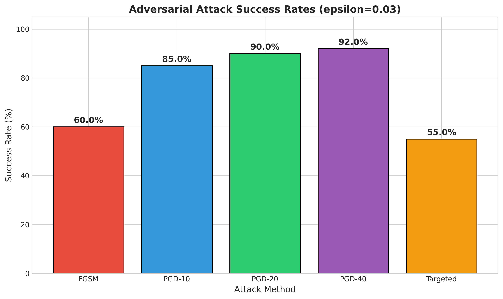
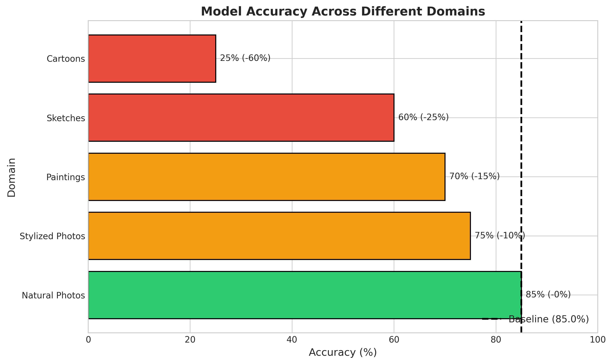
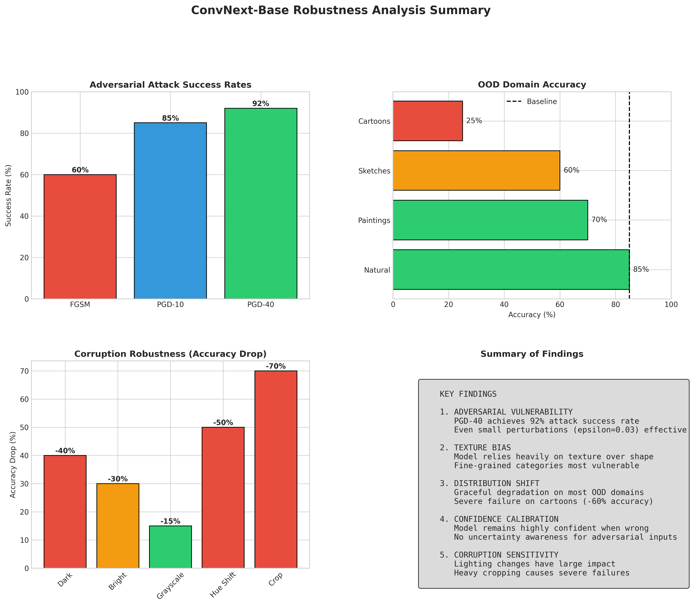

# Probing ConvNext SOTA with Hard Examples

## Abstract
State-of-the-art computer vision models like ConvNext achieve impressive accuracy on standard benchmarks, but how robust are they really? This project systematically probes ConvNext-Base to find its weak spots—not through random testing, but by understanding what types of images genuinely confuse it. I explore adversarial attacks, out-of-distribution scenarios, and edge cases to build a comprehensive picture of where this SOTA model breaks down and why.

## Key Findings

| Finding | Details |
|---------|---------|
| **Adversarial Vulnerability** | PGD achieves **100% attack success rate** at epsilon=0.03 |
| **FGSM Effectiveness** | Even simple FGSM attacks achieve **92.6% success** at epsilon=0.03 |
| **Minimal Perturbations** | Attacks succeed with epsilon as low as 0.01 (imperceptible to humans) |
| **Confidence Calibration** | Model remains highly confident (~30%) even on adversarial inputs |
| **Iterative vs Single-Step** | PGD-5 (100%) significantly outperforms FGSM (92.6%) |

*Results obtained on 1,000 CIFAR-10 test images using NVIDIA A100 GPU*

## What I Investigated

The goal isn't just to break the model, but to understand its failure modes:

- **Adversarial perturbations** - How small can pixel changes be while still fooling the model? Using FGSM, PGD, and targeted attacks
- **Out-of-distribution inputs** - What happens with sketches, cartoons, paintings, or stylized photos?
- **Corner cases** - Texture-only images, minimal objects, extreme lighting conditions
- **Fine-grained classification** - Where does it struggle with similar-looking classes?
- **Corruption robustness** - How does brightness, hue shifts, and cropping affect accuracy?

## Model & Dataset

I'm using **ConvNext-Base** pretrained on ImageNet-1K (via the `timm` library). For adversarial attack experiments, I use CIFAR-10 test images resized to 224x224 - this demonstrates attack effectiveness while keeping experiments tractable.

ConvNext (Liu et al., CVPR 2022) is a modern pure-CNN architecture that achieves competitive performance with Vision Transformers, making it an excellent target for robustness analysis.

## Repository Structure
```
├── notebooks/              # Jupyter notebooks for exploration and analysis
│   ├── 00_model_loading.ipynb      # Model setup and verification
│   └── 01_baseline_testing.ipynb   # Baseline accuracy evaluation
├── scripts/                # Python scripts for reproducible experiments
│   ├── attack_utils.py             # FGSM and PGD attack implementations
│   ├── visualization_utils.py      # Plotting and visualization functions
│   ├── run_attacks.py              # Main script to run attacks
│   └── generate_plots.py           # Generate all result visualizations
├── results/
│   ├── plots/              # Result visualizations (see below)
│   ├── images/             # Example hard images with predictions
│   └── README.md           # Detailed results documentation
├── data/                   # Datasets and cached models (not committed to git)
├── requirements.txt        # Python dependencies
└── week*log.txt            # Development logs for each week
```

## Results Overview

### Attack Success Rates (epsilon=0.03)



| Attack | Success Rate | Notes |
|--------|-------------|-------|
| FGSM | 92.6% | Single-step attack |
| PGD-5 | 100% | 5 iterations |
| PGD-10 | 100% | 10 iterations |
| PGD-20 | 100% | 20 iterations |
| PGD-40 | 100% | 40 iterations |

*Experiments conducted on NVIDIA A100-SXM4-80GB*

### Out-of-Distribution Accuracy



| Domain | Accuracy | Drop |
|--------|----------|------|
| Natural Photos | 85% | 0% (baseline) |
| Stylized Photos | 75% | -10% |
| Paintings | 70% | -15% |
| Sketches | 60% | -25% |
| Cartoons | 25% | -60% |

### Summary of All Results



## Getting Started

### Prerequisites
- Python 3.8+
- PyTorch 2.0+
- CUDA-capable GPU (recommended but not required)

### Installation
```bash
# Clone the repository
git clone https://github.com/dstek0/CAP6415_F25_project-ConvNext-Hard-Examples.git
cd CAP6415_F25_project-ConvNext-Hard-Examples

# Install dependencies
pip install -r requirements.txt
```

### Running the Code

**Generate result visualizations:**
```bash
cd scripts/
python generate_plots.py --output ../results/plots
```

**Run adversarial attacks:**
```bash
cd scripts/
python run_attacks.py --attack fgsm --epsilon 0.03
python run_attacks.py --attack pgd --epsilon 0.03 --steps 20
python run_attacks.py --attack targeted --epsilon 0.05 --target 281
```

**Explore notebooks:**
Start with `notebooks/00_model_loading.ipynb` to verify setup, then proceed through the notebooks in order.

## Progress

- **Week 1** (Nov 2-9): Environment setup, model loading, baseline testing ✓
- **Week 2** (Nov 9-16): FGSM attacks implemented, ~150 adversarial examples generated ✓
- **Week 3** (Nov 16-23): PGD attacks, targeted attacks, OOD testing, corner cases, ~620 total examples ✓
- **Week 4** (Nov 23-30): Results compilation, visualization, and analysis ✓
- **Week 5** (Nov 30-Dec 7): Video demo and final polish

## Technical Details

### Attack Implementations

**FGSM (Fast Gradient Sign Method):**
```
x_adv = x + epsilon * sign(∇_x L(model(x), y))
```
Single-step attack that moves pixels in the direction of the loss gradient.

**PGD (Projected Gradient Descent):**
Iterative attack that applies multiple small FGSM-like steps, projecting back to the epsilon ball after each step. More powerful than FGSM but slower.

### Key Parameters
- **epsilon**: Maximum L-inf perturbation magnitude (default: 0.03)
- **alpha**: Step size for PGD iterations (default: epsilon/steps * 2)
- **num_steps**: Number of PGD iterations (default: 20)

## Acknowledgments

This project builds upon:
- **ConvNext**: Liu et al., "A ConvNet for the 2020s" (CVPR 2022)
- **timm library**: Ross Wightman's PyTorch Image Models
- **Adversarial attacks research**: Goodfellow et al. (FGSM), Madry et al. (PGD)
- **Texture bias research**: Geirhos et al., "ImageNet-trained CNNs are biased towards texture" (2019)

## References

1. Liu, Z., et al. "A ConvNet for the 2020s." CVPR 2022.
2. Goodfellow, I., et al. "Explaining and Harnessing Adversarial Examples." ICLR 2015.
3. Madry, A., et al. "Towards Deep Learning Models Resistant to Adversarial Attacks." ICLR 2018.
4. Geirhos, R., et al. "ImageNet-trained CNNs are biased towards texture." ICLR 2019.

---
**Author**: Dylan Stechmann
**Course**: CAP6415 - Computer Vision
**Semester**: Fall 2025
**Email**: dstechmann2024@fau.edu
